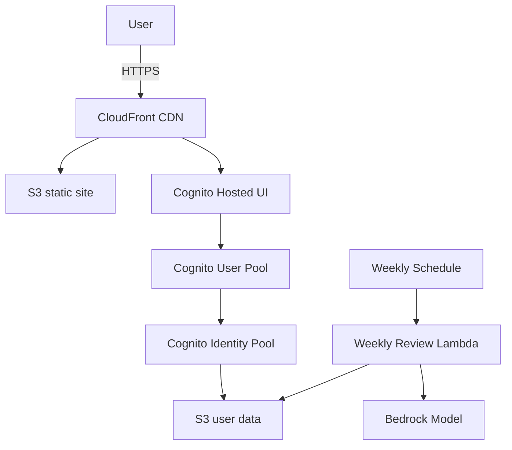

# AutoDiary

AutoDiary is a serverless journaling platform that stores user entries in Amazon S3 and uses AWS Bedrock to generate weekly summaries. The project uses Yarn workspaces to manage the React web client and AWS CDK infrastructure.

For step-by-step configuration instructions, see the [setup guide](docs/setup.md).

## Features

- React web client served from CloudFront with private S3 storage for each user
- Cognito authentication with optional Google, Microsoft, and Apple connectors
- AI-generated weekly summaries using Bedrock, OpenAI, or Gemini
- Infrastructure defined with the AWS CDK and deployed through GitHub Actions

## Architecture



## Prerequisites

- Node.js 20+
- Yarn 4+
- AWS account with permissions to deploy CDK stacks
- AWS CLI configured locally
- (Optional) [GitHub CLI](https://cli.github.com/) for running workflows

## Environment variables

Create `packages/web/.env` and define:

| Variable | Description |
| --- | --- |
| `VITE_REGION` | AWS region for the web client |
| `VITE_USER_POOL_ID` | Cognito user pool id |
| `VITE_USER_POOL_CLIENT_ID` | Cognito app client id |
| `VITE_IDENTITY_POOL_ID` | Cognito identity pool id |
| `VITE_HOSTED_UI_DOMAIN` | Cognito hosted UI domain (from `HostedUiDomain` stack output) |
| `VITE_ENTRY_BUCKET` | S3 bucket for journal entries |
| `VITE_TEST_MODE` | Set to `true` to enable test fixtures |

## Local development

1. Install dependencies:

   ```bash
   yarn install
   ```

2. Start the web application:

   ```bash
   yarn workspace web dev
   ```

3. Work on infrastructure:

   ```bash
   yarn workspace infra build
   yarn workspace infra cdk deploy --all -c domain=<DOMAIN> -c hostedZoneId=<ZONE_ID>
   ```

4. Run tests across all packages:

   ```bash
   yarn test
   ```

5. Build all packages:

   ```bash
   yarn build
   ```

## Deployment and teardown workflows

### GitHub configuration

Set the following repository variables and secrets before running the GitHub Actions workflows.

#### Repository variables

| Variable | Description |
| --- | --- |
| `AWS_ACCOUNT_ID` | AWS account to deploy into |
| `AWS_REGION` | AWS region for all stacks |
| `DOMAIN_NAME` | Root domain name for the application |
| `HOSTED_ZONE_ID` | Route53 hosted zone ID for the domain |
| `AI_PROVIDER` | AI provider for weekly summaries (`bedrock`, `openai`, or `gemini`) |
| `ENABLE_WEEKLY_LAMBDA` | Set to `true` to deploy the scheduled summary Lambda |
| `BEDROCK_TOKEN_CAP` | Maximum Bedrock tokens per user per week |
| `BEDROCK_COST_CAP` | Maximum Bedrock cost per user per week (USD) |
| `BEDROCK_COST_PER_1K` | Bedrock cost in USD per 1K tokens |

#### Repository secrets

- `AWS_ROLE_ARN` – IAM role assumed by GitHub Actions to perform deployments.
- `OPENAI_API_KEY` – optional, required when `AI_PROVIDER` is set to `openai`.
- `GEMINI_API_KEY` – optional, required when `AI_PROVIDER` is set to `gemini`.

### Deploy (`deploy.yml`)

1. Configure repository variables and secrets as described above.
2. Push to `main` or run the workflow manually:

   ```bash
   gh workflow run deploy.yml
   ```

3. The workflow runs tests, deploys the CDK stacks, builds the web client, and uploads assets to S3. The CloudFront distribution URL is printed in the workflow summary.

### Destroy (`destroy.yml`)

1. Ensure the same repository variables and secrets are available.
2. Trigger the workflow from the Actions tab or run:

   ```bash
   gh workflow run destroy.yml
   ```

3. The workflow empties S3 buckets and destroys all CDK stacks for the specified domain and hosted zone.

## Optional connectors

The CDK stack can enable social sign-in with Google, Microsoft, or Apple by looking up OAuth credentials from AWS Systems Manager Parameter Store. Create these parameters in the target AWS account before deploying:

| Parameter | Description |
| --- | --- |
| `google-client-id` | Google OAuth client ID |
| `google-client-secret` | Google OAuth client secret |
| `microsoft-client-id` | Microsoft application (client) ID |
| `microsoft-client-secret` | Microsoft client secret |
| `apple-client-id` | Apple Services ID |
| `apple-team-id` | Apple developer team ID |
| `apple-key-id` | Apple key ID |
| `apple-private-key` | Contents of the Apple `.p8` private key |

Example creation commands using the AWS CLI:

```bash
aws ssm put-parameter --name google-client-id --type String --value <GOOGLE_CLIENT_ID>
aws ssm put-parameter --name google-client-secret --type SecureString --value <GOOGLE_CLIENT_SECRET>
aws ssm put-parameter --name microsoft-client-id --type String --value <MICROSOFT_CLIENT_ID>
aws ssm put-parameter --name microsoft-client-secret --type SecureString --value <MICROSOFT_CLIENT_SECRET>
aws ssm put-parameter --name apple-client-id --type String --value <APPLE_CLIENT_ID>
aws ssm put-parameter --name apple-team-id --type String --value <APPLE_TEAM_ID>
aws ssm put-parameter --name apple-key-id --type String --value <APPLE_KEY_ID>
aws ssm put-parameter --name apple-private-key --type SecureString --value "$(cat AuthKey.p8)"
```

Ensure the IAM role supplied via the `AWS_ROLE_ARN` secret can call `ssm:GetParameter` (and `kms:Decrypt` for secure strings).

## Weekly review Lambda

An optional scheduled Lambda summarises each user's week using the configured AI provider. It runs every Sunday at 19:00 UTC and writes summaries back to the user's data bucket. Deploy `packages/infra/lib/weekly-review-stack.ts` to enable the feature; omit the stack to skip weekly summaries.

### Lambda environment variables

| Variable | Description |
| --- | --- |
| `AI_PROVIDER` | AI provider to use (`bedrock`, `openai`, or `gemini`) |
| `BEDROCK_MODEL_ID` | Bedrock model used for AI summaries |
| `BEDROCK_TOKEN_CAP` | Maximum tokens per user per week (Bedrock) |
| `BEDROCK_COST_CAP` | Maximum cost per user per week (Bedrock) |
| `BEDROCK_SUMMARY_TOKEN_LIMIT` | Token limit for generated summaries (Bedrock) |
| `BEDROCK_COST_PER_1K` | Cost in USD per 1K tokens (Bedrock) |
| `OPENAI_MODEL_ID` | OpenAI model used for AI summaries |
| `OPENAI_TOKEN_CAP` | Maximum tokens per user per week (OpenAI) |
| `OPENAI_COST_CAP` | Maximum cost per user per week (OpenAI) |
| `OPENAI_SUMMARY_TOKEN_LIMIT` | Token limit for generated summaries (OpenAI) |
| `OPENAI_COST_PER_1K` | Cost in USD per 1K tokens (OpenAI) |
| `GEMINI_MODEL_ID` | Gemini model used for AI summaries |
| `GEMINI_TOKEN_CAP` | Maximum tokens per user per week (Gemini) |
| `GEMINI_COST_CAP` | Maximum cost per user per week (Gemini) |
| `GEMINI_SUMMARY_TOKEN_LIMIT` | Token limit for generated summaries (Gemini) |
| `GEMINI_COST_PER_1K` | Cost in USD per 1K tokens (Gemini) |
| `BUCKET_NAME` | Target bucket for results |

