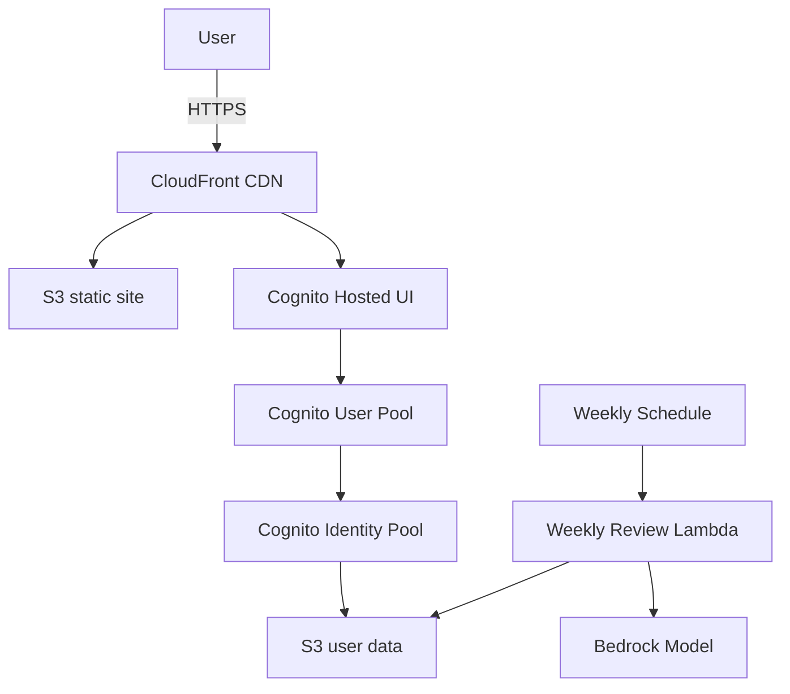

# AutoDiary

AutoDiary is a serverless journaling platform that stores user entries in Amazon S3 and uses AWS Bedrock to generate weekly summaries. The project uses npm workspaces to manage the React web client and AWS CDK infrastructure.

## Architecture



## Prerequisites

- Node.js 20+
- npm 9+
- AWS account with permissions to deploy CDK stacks
- AWS CLI configured locally
- (Optional) [GitHub CLI](https://cli.github.com/) for running workflows

## Environment variables

| Variable | Description |
| --- | --- |
| `VITE_REGION` | AWS region for the web client |
| `VITE_USER_POOL_ID` | Cognito user pool id |
| `VITE_USER_POOL_CLIENT_ID` | Cognito app client id |
| `VITE_IDENTITY_POOL_ID` | Cognito identity pool id |
| `VITE_HOSTED_UI_DOMAIN` | Cognito hosted UI domain |
| `VITE_ENTRY_BUCKET` | S3 bucket for journal entries |
| `VITE_TEST_MODE` | Set to `true` to enable test fixtures |

### Weekly review Lambda

| Variable | Description |
| --- | --- |
| `BEDROCK_MODEL_ID` | Bedrock model used for AI summaries |
| `USER_TOKEN_CAP` | Maximum tokens per user per week |
| `SUMMARY_TOKEN_LIMIT` | Token limit for generated summaries |
| `BUCKET_NAME` | Target bucket for results |

CDK workflows also expect repository variables `AWS_ACCOUNT_ID`, `AWS_REGION`, `DOMAIN_NAME`, and `HOSTED_ZONE_ID`, and a secret `AWS_ROLE_ARN` for assuming deployment roles.

## Local development

1. Install dependencies:

   ```bash
   npm install
   ```

2. Create `packages/web/.env` and define the `VITE_*` variables listed above.

3. Start the web application:

   ```bash
   npm run dev --workspace web
   ```

4. To work on infrastructure:

   ```bash
   npm run build --workspace infra
   npm run cdk --workspace infra deploy --all -c domain=<DOMAIN> -c hostedZoneId=<ZONE_ID>
   ```

## GitHub Actions

Two workflows automate infrastructure management:

- **Deploy infrastructure** (`deploy.yml`): runs on pushes to `main` or manually with `workflow_dispatch`. Execute locally with `gh workflow run deploy.yml`.
- **Destroy infrastructure** (`destroy.yml`): removes stacks and empties S3 buckets. Trigger manually from the Actions tab or with `gh workflow run destroy.yml`.

## Optional features

The `weekly-review` Lambda summarises each user's week using Amazon Bedrock and runs every Sunday at 19:00 UTC. Deploy `packages/infra/lib/weekly-review-stack.ts` if this feature is desired; otherwise it can be omitted.

