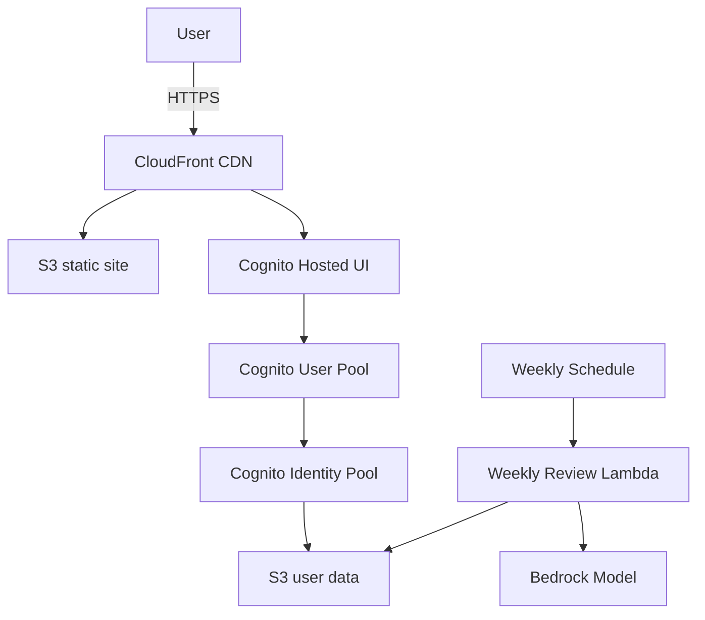

# AutoDiary

AutoDiary is a serverless journaling platform that stores user entries in Amazon S3 and uses AWS Bedrock to generate weekly summaries. The project uses Yarn workspaces to manage the React web client and AWS CDK infrastructure.

## Features

- React web client served from CloudFront with private S3 storage for each user
- Cognito authentication with optional Google, Microsoft, and Apple connectors
- AI-generated weekly summaries using Bedrock, OpenAI, or Gemini
- Infrastructure defined with the AWS CDK and deployed through GitHub Actions

## Architecture



## Prerequisites

- Node.js 20+
- Yarn 4+
- AWS account with permissions to deploy CDK stacks
- AWS CLI configured locally
- (Optional) [GitHub CLI](https://cli.github.com/) for running workflows

## Environment variables

| Variable | Description |
| --- | --- |
| `VITE_REGION` | AWS region for the web client |
| `VITE_USER_POOL_ID` | Cognito user pool id |
| `VITE_USER_POOL_CLIENT_ID` | Cognito app client id |
| `VITE_IDENTITY_POOL_ID` | Cognito identity pool id |
| `VITE_HOSTED_UI_DOMAIN` | Cognito hosted UI domain (from `HostedUiDomain` stack output) |
| `VITE_ENTRY_BUCKET` | S3 bucket for journal entries |
| `VITE_TEST_MODE` | Set to `true` to enable test fixtures |

### Weekly review Lambda

| Variable | Description |
| --- | --- |
| `AI_PROVIDER` | AI provider to use (`bedrock`, `openai`, or `gemini`) |
| `BEDROCK_MODEL_ID` | Bedrock model used for AI summaries |
| `BEDROCK_TOKEN_CAP` | Maximum tokens per user per week (Bedrock) |
| `BEDROCK_COST_CAP` | Maximum cost per user per week (Bedrock) |
| `BEDROCK_SUMMARY_TOKEN_LIMIT` | Token limit for generated summaries (Bedrock) |
| `BEDROCK_COST_PER_1K` | Cost in USD per 1K tokens (Bedrock) |
| `OPENAI_MODEL_ID` | OpenAI model used for AI summaries |
| `OPENAI_TOKEN_CAP` | Maximum tokens per user per week (OpenAI) |
| `OPENAI_COST_CAP` | Maximum cost per user per week (OpenAI) |
| `OPENAI_SUMMARY_TOKEN_LIMIT` | Token limit for generated summaries (OpenAI) |
| `OPENAI_COST_PER_1K` | Cost in USD per 1K tokens (OpenAI) |
| `GEMINI_MODEL_ID` | Gemini model used for AI summaries |
| `GEMINI_TOKEN_CAP` | Maximum tokens per user per week (Gemini) |
| `GEMINI_COST_CAP` | Maximum cost per user per week (Gemini) |
| `GEMINI_SUMMARY_TOKEN_LIMIT` | Token limit for generated summaries (Gemini) |
| `GEMINI_COST_PER_1K` | Cost in USD per 1K tokens (Gemini) |
| `BUCKET_NAME` | Target bucket for results |

### Optional connectors

The CDK stack can enable social sign-in with Google, Microsoft, or Apple by
looking up OAuth credentials from AWS Systems Manager Parameter Store. Create
these parameters in the target account before deploying:

| Parameter | Description |
| --- | --- |
| `google-client-id` | Google OAuth client ID |
| `google-client-secret` | Google OAuth client secret |
| `microsoft-client-id` | Microsoft application (client) ID |
| `microsoft-client-secret` | Microsoft client secret |
| `apple-client-id` | Apple Services ID |
| `apple-team-id` | Apple developer team ID |
| `apple-key-id` | Apple key ID |
| `apple-private-key` | Contents of the Apple `.p8` private key |

Example creation commands using the AWS CLI:

```bash
aws ssm put-parameter --name google-client-id --type String --value <GOOGLE_CLIENT_ID>
aws ssm put-parameter --name google-client-secret --type SecureString --value <GOOGLE_CLIENT_SECRET>
aws ssm put-parameter --name microsoft-client-id --type String --value <MICROSOFT_CLIENT_ID>
aws ssm put-parameter --name microsoft-client-secret --type SecureString --value <MICROSOFT_CLIENT_SECRET>
aws ssm put-parameter --name apple-client-id --type String --value <APPLE_CLIENT_ID>
aws ssm put-parameter --name apple-team-id --type String --value <APPLE_TEAM_ID>
aws ssm put-parameter --name apple-key-id --type String --value <APPLE_KEY_ID>
aws ssm put-parameter --name apple-private-key --type SecureString --value "$(cat AuthKey.p8)"
```

The deployment workflow (`deploy.yml`) reads these parameters during `cdk deploy`.
Ensure the IAM role supplied via the `AWS_ROLE_ARN` secret can call
`ssm:GetParameter` (and `kms:Decrypt` for secure strings).

## Local development

1. Install dependencies:

   ```bash
   yarn install
   ```

2. Create `packages/web/.env` and define the `VITE_*` variables listed above (use the `HostedUiDomain` stack output for `VITE_HOSTED_UI_DOMAIN`).

3. Start the web application:

   ```bash
   yarn workspace web dev
   ```

4. To work on infrastructure:

   ```bash
   yarn workspace infra build
   yarn workspace infra cdk deploy --all -c domain=<DOMAIN> -c hostedZoneId=<ZONE_ID>
   ```

5. Run tests across all packages:

   ```bash
   yarn test
   ```

6. Build all packages:

   ```bash
   yarn build
   ```

## CI/CD (GitHub Actions)

The repository includes workflows for deploying and destroying infrastructure.
Both require repository variables `AWS_ACCOUNT_ID`, `AWS_REGION`,
`DOMAIN_NAME`, and `HOSTED_ZONE_ID`, and a secret `AWS_ROLE_ARN` used to
assume deployment roles.

- **Deploy infrastructure** (`deploy.yml`): runs on pushes to `main` or on
  demand. Trigger from the Actions tab or locally with:
  `gh workflow run deploy.yml`.
- **Destroy infrastructure** (`destroy.yml`): removes stacks and empties S3
  buckets. Trigger from the Actions tab or with:
  `gh workflow run destroy.yml`.

## Weekly review Lambda

An optional scheduled Lambda summarises each user's week using the configured
AI provider. It runs every Sunday at 19:00 UTC and writes summaries back to the
user's data bucket. Deploy `packages/infra/lib/weekly-review-stack.ts` to
enable the feature; omit the stack to skip weekly summaries.

